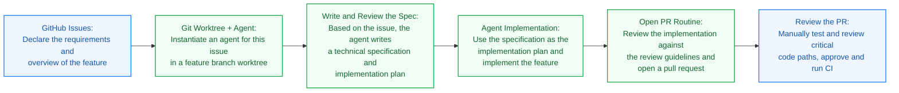

# Agent Workflow

```mermaid
flowchart LR
    A["GitHub Issues:<br/>Declare the requirements and<br/>overview of the feature"]
    B["Git Worktree + Agent:<br/>Instantiate an agent for this issue<br/>in a feature branch worktree"]
    C["Write and Review the Spec:<br/>Based on the issue, the agent writes<br/>a technical specification and<br/>implementation plan"]
    D["Agent Implementation:<br/>Use the specification as the<br/>implementation plan and<br/>implement the feature"]
    E["Open PR Routine:<br/>Review the implementation against<br/>the review guidelines and<br/>open a pull request"]
    F["Review the PR:<br/>Manually test and review critical<br/>code paths, approve and run CI"]

    A --> B --> C --> D --> E --> F

    classDef human fill:#EFF6FF,stroke:#1677FF,color:#1255AC,stroke-width:1.5px
    classDef agent fill:#F0FDF4,stroke:#16A34A,color:#166534,stroke-width:1.5px

    class A,F human
    class B,C,D,E agent
```